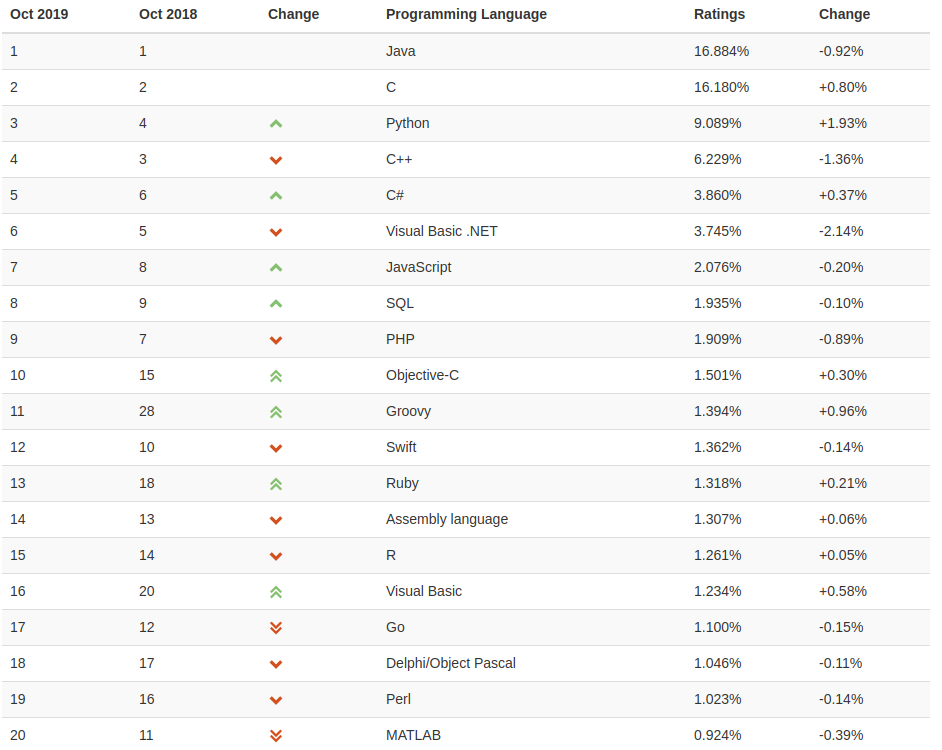

# 为什么学编程

## 为什么要学编程 -- 给小朋友看的

因为计算机工作起来很快，也不需要睡觉。会编程就掌握了计算机所说的语言，就可以和计算机沟通交流，让它为你做想做的事了。看一段视频吧:


## 为什么要学编程 -- 给小朋友爸爸妈妈看的

编程可以当成另外一个兴趣班，让喜欢玩游戏的小朋友编游戏给别人玩。跟数学一样，编程也可以参加竞赛，比如USACO\(USA Computing Olympiad， 即美国计算机奥林匹克竞赛\)。相比AMC\(American Mathematics Competition，即美国数学联赛\)，USACO开放给全世界编程爱好者，不分年龄，能上网就能打比赛，完全免费。而且USACO分为铜，银，金，铂金四个级别，铜级小学生就能开打。如果能打到铂金级别，就可以被邀请参加美国信息学奥赛国家队选拔。

另外，相比数学，编程需要一定的门槛，导致参加编程竞赛人数与参加数学竞赛的相比，少不少。而编程是需要比较好的数学基础，如果小朋友对数学感兴趣，那不用费太多力，顺便也来玩玩编程吧。

# 为什么学Python

Python非常流行。下图是2019年10月编程语言流行度的排名\(最新的参见：[https://www.tiobe.com/tiobe-index/](https://www.tiobe.com/tiobe-index/)\)：

可以看出Python流行度在第三名。如果是在人工智能领域\(Artificial Intelligence, AI\)，Python可是处在当之无愧的老大位置。

在大人世界有“人生苦短，我用Python" \(Life is short, use Python\)的说法。当然，小朋友的人生才刚打开，但Python确实非常容易上手，不需要任何语言基础。或许你以前学过Scratch之类的图形编程，很好玩，区块的模式也简单易懂一些。但Scratch毕竟能做的东西有限，如果你喜欢编程，我们追究要往前迈一步，转向使用文字进行编程。而你之前所学的Scratch也将非常有助于你对新的编程语言的理解。

