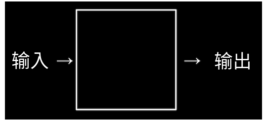

# 计算机科学与二进制

## 计算机科学

和数学，物理，化学一样，计算机科学是一门学科，它做的事情，就是解决问题\(problem-solving\)。计算机解决问题的过程可以按照如下表示：



它从要解决的具体问题获得一些输入，然后产生答案做为输出。中间的黑盒子就是计算机科学。比如要让计算机科学计算1+2等于多少，那么1和2就是输入，3是最后的输出，计算机科学在这里要干的事就是进行加法运算。

## 二进制

上一节我们提到过二进制。如果你掌握了二进制数数的方法，不难得出我们两只手可以从0数到1023。在正式用数学方式介绍二进制之前，我们先简单回顾一下我们熟悉的十进制吧。

* 下面是我们熟悉的十进制123

  ```text
  1 2 3
  ```

  * 1在百位，2在十位，3在个位
  * $$100 \times 1 + 10 \times 2 + 1 \times 3 = 100 + 20 + 3 = 123$$ 
  * 每一位数字都有10种可能，所以也可以写成 $$10^2 \times 1 + 10^1 \times 2 + 10^0 \times 3 = 123$$ 

* 那么我们不大熟悉的二进制呢？从左往右，第一位跟十进制一样，还是代表1。第二位就不是代表10了，而是2。第三也不是百位，而是代表4，第四位代表8， 第五位代表16，以此类推。那么二进制101代表什么呢？

  ```text
  4 2 1
  1 0 1
  ```

  * 第一个1在“四”位，0在“二”位，第二个1在个位
  * $$4 \times 1 + 2 \times + 1 \times 1 = 4 + 0 + 1 = 5$$ 
  * 每一位数字都有2种可能，所以也可以写成 $$2^2 \times 1 + 2^1 \times 0 + 2^0 \times 1 = 4 +0+1 = 5$$ 

  🤔 思考一下二进制10011代表什么吧。

那么计算机为什么要用这种难懂的二进制呢？主要是我们现在用的计算机叫电子计算机，是通过电进行运算的。电看不见摸不着怎么表示数字呢？我们可以设置个开关，开表示1，关表示0\(更确切点是高电压表示1，低电压表示0\)，每一位开关叫比特\(bit\)，没错，比特币的比特。就跟下面这8个灯泡一样。


灯泡上面一行数字表示该比特代表的十进制值。灯泡下面一行是它的编号，还记得计算机中习惯从0开始计数吗？我们思考一下上面一排数和下面一排数的关系吧。你发现没有，对于编号2的灯泡和它的值4可以表示成 $$2^2 = 4$$ ，这是个偶然吗？

中间的灯泡，我们说亮的表示1，暗的表示0，上面8个灯泡就代表二进制01100110。我们一起算一下上面灯泡应该是十进制中数字吧：

$$
2^6 \times 1 + 2^5 \times 1 + 2^4 \times 1 + 2^2 \times 1 = 64 + 32 + 4 + 2 = 102
$$

类似这样的”灯泡“在计算机中叫晶体管\(transistor \)，计算机的大脑CPU中，有几十亿的晶体管，他们每8个组成一组，叫字节\(Byte\)，所以它数数应该没有问题了。

