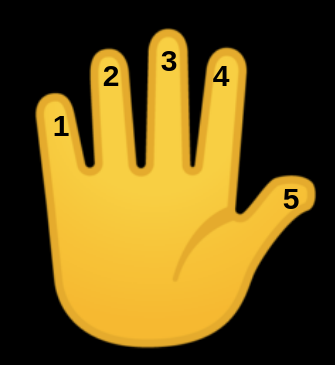
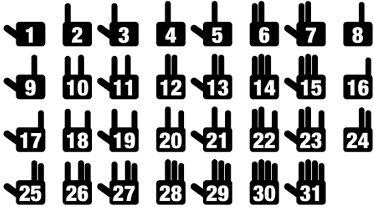

# 懂计算机的人和不懂计算机的人

在汉语里，当我们说数字很少的时候，经常会说，一只手都能数的过来。



因为生活中，我们使用十进制，一只手只能数到5。记得小时候爸爸妈妈让你数羊吗？有时候羊太多了10个手指头不够用，是不是还要用上脚趾头呢？

但是如果你学了计算机，你就可以用一只手数到31，你相信吗？如果你学了8年级或者9年级的数学，很容易通过排列组合分析出来。因为每个手指可以表示竖起来，或者合下去两种状态，所以总共可以表示数目如下：

$$
2^5 = 32
$$

如果你没学到8年级或者9年级的数学，对上面的公式也不知所云，没关系，我们可以通过具体例子演示一下。



怎么样，很神奇吧。这种方式叫二进制，是计算机中表示数字的方式。后面我们还会具体介绍。

🤔 留个思考题给你，如果用两只手，这种方法能数到多少呢？

懂计算机的人不但能用一只手数更多的羊，而且喜欢从0开始数。因为计算机中计数是从0开始，而不是从1开始。

# 计算机科学与二进制

## 计算机科学

和数学，物理，化学一样，计算机科学是一门学科，它做的事情，就是解决问题\(problem-solving\)。计算机解决问题的过程可以按照如下表示：


它从要解决的具体问题获得一些输入，然后产生答案做为输出。中间的黑盒子就是计算机科学。比如要让计算机科学计算1+2等于多少，那么1和2就是输入，3是最后的输出，计算机科学在这里要干的事就是进行加法运算。

## 二进制

上一节我们提到过二进制。如果你掌握了二进制数数的方法，不难得出我们两只手可以从0数到1023。在正式用数学方式介绍二进制之前，我们先简单回顾一下我们熟悉的十进制吧。

* 下面是我们熟悉的十进制123

  ```text
  1 2 3
  ```

  * 1在百位，2在十位，3在个位
  * $$100 \times 1 + 10 \times 2 + 1 \times 3 = 100 + 20 + 3 = 123$$ 
  * 每一位数字都有10种可能，所以也可以写成 $$10^2 \times 1 + 10^1 \times 2 + 10^0 \times 3 = 123$$ 

* 那么我们不大熟悉的二进制呢？从左往右，第一位跟十进制一样，还是代表1。第二位就不是代表10了，而是2。第三也不是百位，而是代表4，第四位代表8， 第五位代表16，以此类推。那么二进制101代表什么呢？

  ```text
  4 2 1
  1 0 1
  ```

  * 第一个1在“四”位，0在“二”位，第二个1在个位
  * $$4 \times 1 + 2 \times + 1 \times 1 = 4 + 0 + 1 = 5$$ 
  * 每一位数字都有2种可能，所以也可以写成 $$2^2 \times 1 + 2^1 \times 0 + 2^0 \times 1 = 4 +0+1 = 5$$ 

  🤔 思考一下二进制10011代表什么吧。

那么计算机为什么要用这种难懂的二进制呢？主要是我们现在用的计算机叫电子计算机，是通过电进行运算的。电看不见摸不着怎么表示数字呢？我们可以设置个开关，开表示1，关表示0\(更确切点是高电压表示1，低电压表示0\)，每一位开关叫比特\(bit\)，没错，比特币的比特。就跟下面这8个灯泡一样。


灯泡上面一行数字表示该比特代表的十进制值。灯泡下面一行是它的编号，还记得计算机中习惯从0开始计数吗？我们思考一下上面一排数和下面一排数的关系吧。你发现没有，对于编号2的灯泡和它的值4可以表示成 $$2^2 = 4$$ ，这是个偶然吗？

中间的灯泡，我们说亮的表示1，暗的表示0，上面8个灯泡就代表二进制01100110。我们一起算一下上面灯泡应该是十进制中数字吧：

$$
2^6 \times 1 + 2^5 \times 1 + 2^4 \times 1 + 2^2 \times 1 = 64 + 32 + 4 + 2 = 102
$$

类似这样的”灯泡“在计算机中叫晶体管\(transistor \)，计算机的大脑CPU中，有几十亿的晶体管，他们每8个组成一组，叫字节\(Byte\)，所以它数数应该没有问题了。

# 数据表示

光会数数，那计算机不就只是个计算器了吗？数字我们知道在计算机中怎么表示了，那么文字，图片，视频，还有声音呢？

## 文字

* To represent letters, all we need to do is decide how numbers map to letters. Some humans, many years ago, collectively decided on a standard mapping called [ASCII](https://en.wikipedia.org/wiki/ASCII). The letter “A”, for example, is the number 65, and “B” is 66, and so on. The mapping also includes punctuation and other symbols. Other characters, like letters with accent marks, and emoji, are part of a standard called [Unicode](https://en.wikipedia.org/wiki/Unicode) that use more bits than ASCII to accommodate all these characters.
  * When we receive an emoji, our computer is actually just receiving a decimal number like `128514` \(`11111011000000010` in binary, if you can read that more easily\) that it then maps to the image of the emoji.

## 图片

* An image, too, is comprised of many smaller square dots, or pixels, each of which can be represented in binary with a system called RGB, with values for red, green, and blue light in each pixel. By mixing together different amounts of each color, we can represent millions of colors: 
  * The red, green, and blue values are combined to get a light yellow color: 
* We can see this in an emoji if we zoom in far enough: 

## 视频

* And computer programs know, based on the context of its code, whether the binary numbers should be interpreted as numbers, or letters, or pixels.
* And videos are just many, many images displayed one after another, at some number of frames per second. Music, too, can be represented by the notes being played, their duration, and their volume.

## 声音

声音blabla

# 算法

* So now we can represent inputs and outputs. The black box earlier will contain _algorithms_, step-by-step instructions for solving a problem: 
* Let’s say we wanted to find a friend, Mike Smith, in a phone book.
  * We could start by flipping through the book, one page at a time, until we find Mike Smith or reach the end of the book.
  * We could also flip two pages at a time, but if we go too far, we’ll have to know to go back a page.
  * But an even more efficient way would be opening the phone book to the middle, decide whether Mike will be in the left half or right half of the book \(because the book is alphabetized\), and immediately throw away half of the problem. We can repeat this, dividing the problem in half each time. With 1024 pages to start, we would only need 10 steps of dividing in half before we have jsut one page remaining to check.
* In fact, we can represent the efficiency of each of those algorithms with a chart: 
  * Our first solution, one page at a time, is like the red line: our time to solve increases linearly as the size of the problem increases.
  * The second solution, two pages at a time, is like the yellow line: our slope is less steep, but still linear.
  * Our final solution, is like the green line: logarithmic, since our time to solve rises more and more slowly as the size of the problem increases. In other words, if the phone book went from 1000 to 2000 pages, we would need one more step to find Mike. If the size doubled again from 2000 to 4000 pages, we would still only need one more step.

