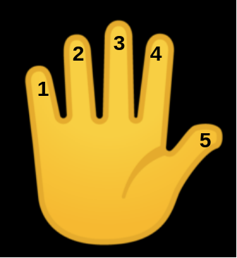
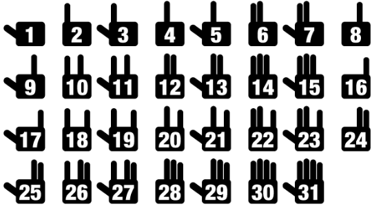

# 懂计算机的人和不懂计算机的人

在汉语里，当我们说数字很少的时候，经常会说，一只手都能数的过来。

因为生活中，我们使用十进制，一只手只能数到5。记得小时候爸爸妈妈让你数羊吗？有时候羊太多了10个手指头不够用，是不是还要用上脚趾头呢？

但是如果你学了计算机，你就可以用一只手数到31，你相信吗？如果你学了8年级或者9年级的数学，很容易通过排列组合分析出来。因为每个手指可以表示竖起来，或者合下去两种状态，所以总共可以表示数目如下：

$$
2^5 = 32
$$

如果你没学到8年级或者9年级的数学，对上面的公式也不知所云，没关系，我们可以通过具体例子演示一下。

怎么样，很神奇吧。这种方式叫二进制，是计算机中表示数字的方式。后面我们还会具体介绍。

🤔 留个思考题给你，如果用两只手，这种方法能数到多少呢？

懂计算机的人不但能用一只手数更多的羊，而且喜欢从0开始数。因为计算机中计数是从0开始，而不是从1开始。

