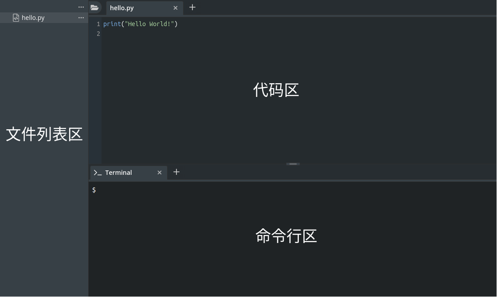
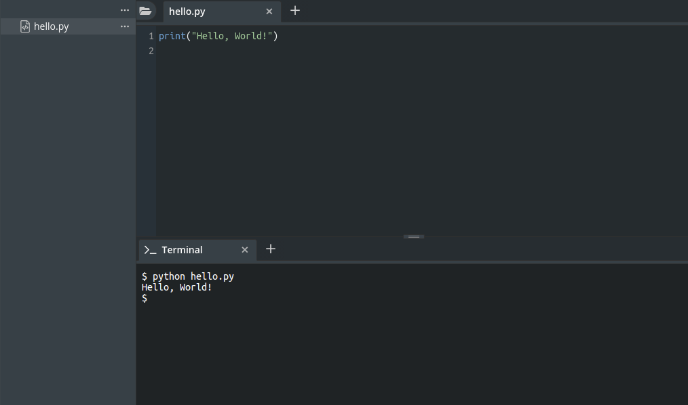
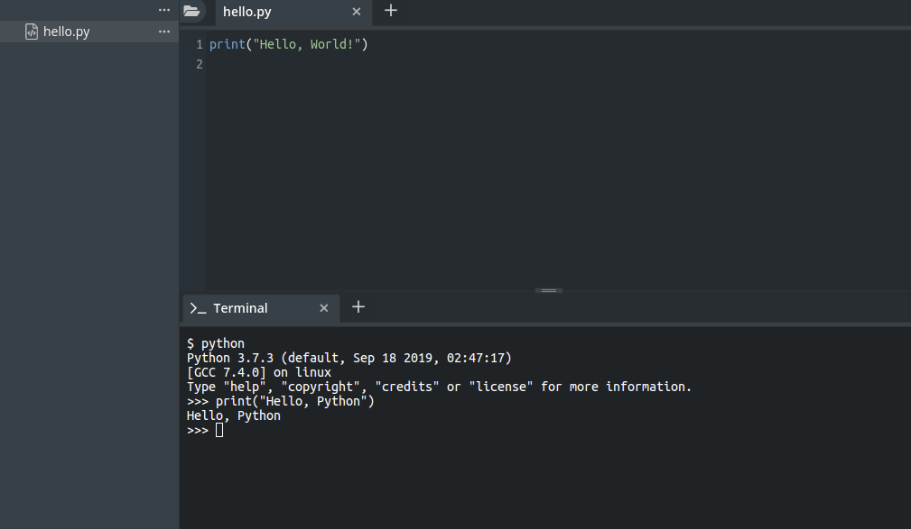

# 编程环境介绍

介绍了计算机的一些基本知识后，不知你是否以及迫不及待的想要开始编程了。这章开始，我们将撸起袖子，开始编程了。

Python入门的一个障碍，就是要在电脑上安装Python和相关软件，还涉及到不同的版本。为了简化和统一版本，我们使用网址：[https://lab.cs50.io/io6-com/cs50-for-kids/master/ch02-hello-world/](https://lab.cs50.io/io6-com/cs50-for-kids/master/ch02-hello-world/) （需要用Github账号登录，如果没有Github，可以注册一下）先看一下我们将要编程的环境吧：



## 第一个程序

按照惯例，一门新语言的第一个程序都会是打印“Hello World"。在Python中，它是这样的：

```python
print("Hello, World!")
```

print是Python提供的函数，它的功能就是把字符显示在屏幕上\(不是打印在纸上\)。我们在代码区敲入上面的程序，然后在命令行区输入：

```bash
python hello.py
```



我们看到，”Hello, World!"已经打印在屏幕上了。

我们还可以有另外一种方式编写和运行程序。我们在命令行区输入python，启动Python的解释器（interpreter），然后输入print\("Hello, Python"\)的语句，同样也可以把字符串打印到屏幕上。



这种叫交互式方式（Interactive Mode），适用于编写简单的比较简短的程序。我们前面的章节大部分都会用这种在解释器上直接交互式编写的方式来编程，后面等程序稍微复杂时候，我们会切换到到代码区编写程序，然后使用命令python执行我们的程序。

```python
Python 3.7.3 (default, Sep 18 2019, 02:47:17) 
[GCC 7.4.0] on linux
Type "help", "copyright", "credits" or "license" for more information.
>>> print("Hello, Python")
Hello, Python
```

这里，前三行包含了Python解释器的版本信息以及运行的操作系统信息。第四行的“&gt;&gt;&gt;” 是个提示符（prompt），表示你可以在此编写代码了。编写后回车（Enter）即可看到程序的运行结果。如果要退出Python解释器，打exit\(\)命令即可。

```python
>>> exit()
```

